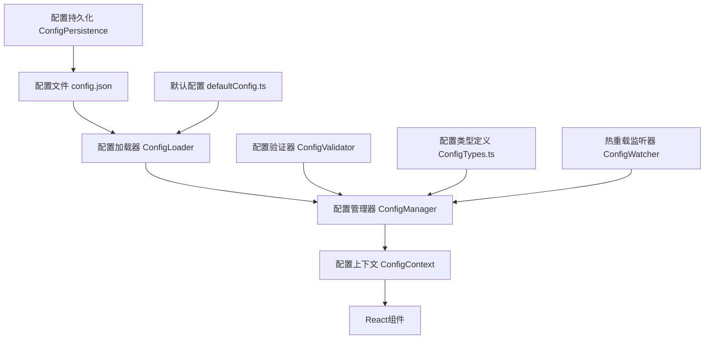

# 配置解耦设计文档

## 概述

本设计文档描述了一个统一的配置管理系统，用于将项目中分散的硬编码配置值提取到配置文件中，实现配置与代码的解耦。系统将支持JSON配置文件、TypeScript类型安全、热重载和配置验证等功能。

## 架构

### 整体架构



### 配置层次结构

1. **默认配置层**: 硬编码的默认值，确保系统始终可用
2. **文件配置层**: 从config.json加载的用户配置
3. **运行时配置层**: 运行时动态修改的配置（可选）
4. **环境配置层**: 基于环境变量的配置覆盖（可选）

## 组件和接口

### 1. 配置类型定义 (ConfigTypes.ts)

```typescript
// 应用核心配置
interface AppConfig {
  points: {
    min: number;
    max: number;
    step: number;
    default: number;
  };
  paths: {
    maxCount: number;
  };
  canvas: {
    aspectRatio: number;
    defaultWidth: number;
    defaultHeight: number;
  };
}

// UI和视觉配置
interface UIConfig {
  colors: {
    base: {
      alpha1: string;
      alpha2: string;
      alpha3: string;
    };
    highlight: string[];
    axis: string;
  };
  animations: {
    transitionDuration: number;
    debounceDelay: number;
    animationEasing: string;
  };
  notifications: {
    defaultDuration: number;
    successDuration: number;
    errorDuration: number;
    warningDuration: number;
    infoDuration: number;
    maxCount: number;
  };
  layout: {
    breakpoints: {
      mobile: number;
      tablet: number;
      desktop: number;
    };
    panelWidths: {
      control: number;
      data: number;
      minCanvas: number;
    };
  };
}

// 性能和缓存配置
interface PerformanceConfig {
  cache: {
    maxSize: number;
    defaultTTL: number;
    partitionCacheSize: number;
  };
  rendering: {
    webgl: {
      pointSize: number;
      maxPointSize: number;
      lineWidth: number;
    };
    canvas2d: {
      lineWidth: number;
      pointRadius: number;
    };
  };
  performance: {
    benchmarkThresholds: {
      fast: number;
      medium: number;
      slow: number;
    };
    batchSizes: {
      pathGeneration: number;
      rendering: number;
    };
  };
}

// 开发和测试配置
interface DevelopmentConfig {
  testIds: Record<string, string>;
  debug: {
    enabled: boolean;
    logLevel: 'error' | 'warn' | 'info' | 'debug';
    showPerformanceMetrics: boolean;
  };
  features: {
    hotReload: boolean;
    configValidation: boolean;
    typeChecking: boolean;
  };
}

// 完整配置接口
interface AppConfiguration {
  app: AppConfig;
  ui: UIConfig;
  performance: PerformanceConfig;
  development: DevelopmentConfig;
  version: string;
  lastModified: string;
}
```

### 2. 配置管理器 (ConfigManager.ts)

```typescript
class ConfigManager {
  private config: AppConfiguration;
  private listeners: Set<ConfigChangeListener>;
  private validator: ConfigValidator;
  
  // 加载配置
  async loadConfig(): Promise<void>;
  
  // 获取配置值
  get<T>(path: string): T;
  
  // 设置配置值
  set<T>(path: string, value: T): void;
  
  // 重置为默认配置
  resetToDefaults(): void;
  
  // 验证配置
  validateConfig(config: Partial<AppConfiguration>): ValidationResult;
  
  // 监听配置变化
  subscribe(listener: ConfigChangeListener): () => void;
  
  // 保存配置到文件
  saveConfig(): Promise<void>;
}
```

### 3. 配置上下文 (ConfigContext.tsx)

```typescript
interface ConfigContextType {
  config: AppConfiguration;
  updateConfig: (path: string, value: any) => void;
  resetConfig: () => void;
  isLoading: boolean;
  error: string | null;
}

const ConfigContext = React.createContext<ConfigContextType | null>(null);

export const ConfigProvider: React.FC<{ children: React.ReactNode }> = ({ children }) => {
  // 配置管理逻辑
};

export const useConfig = () => {
  const context = useContext(ConfigContext);
  if (!context) {
    throw new Error('useConfig must be used within ConfigProvider');
  }
  return context;
};
```

### 4. 配置验证器 (ConfigValidator.ts)

```typescript
interface ValidationRule {
  path: string;
  type: 'number' | 'string' | 'boolean' | 'array' | 'object';
  required?: boolean;
  min?: number;
  max?: number;
  pattern?: RegExp;
  validator?: (value: any) => boolean;
}

class ConfigValidator {
  private rules: ValidationRule[];
  
  validate(config: Partial<AppConfiguration>): ValidationResult;
  addRule(rule: ValidationRule): void;
  removeRule(path: string): void;
}
```

## 数据模型

### 配置文件结构 (config.json)

```json
{
  "version": "1.0.0",
  "lastModified": "2025-01-08T10:00:00Z",
  "app": {
    "points": {
      "min": 10000,
      "max": 2000000,
      "step": 10000,
      "default": 50000
    },
    "paths": {
      "maxCount": 20000
    },
    "canvas": {
      "aspectRatio": 1.333,
      "defaultWidth": 800,
      "defaultHeight": 600
    }
  },
  "ui": {
    "colors": {
      "base": {
        "alpha1": "rgba(209, 213, 219, 0.5)",
        "alpha2": "rgba(209, 213, 219, 0.35)",
        "alpha3": "rgba(209, 213, 219, 0.2)"
      },
      "highlight": [
        "#FBBF24", "#F87171", "#34D399", 
        "#818CF8", "#F472B6", "#60A5FA"
      ],
      "axis": "rgba(255, 255, 255, 0.2)"
    },
    "animations": {
      "transitionDuration": 200,
      "debounceDelay": 300,
      "animationEasing": "ease-in-out"
    },
    "notifications": {
      "defaultDuration": 3000,
      "successDuration": 2000,
      "errorDuration": 0,
      "warningDuration": 3000,
      "infoDuration": 3000,
      "maxCount": 5
    },
    "layout": {
      "breakpoints": {
        "mobile": 768,
        "tablet": 1024,
        "desktop": 1240
      },
      "panelWidths": {
        "control": 280,
        "data": 360,
        "minCanvas": 600
      }
    }
  },
  "performance": {
    "cache": {
      "maxSize": 100,
      "defaultTTL": 300000,
      "partitionCacheSize": 20
    },
    "rendering": {
      "webgl": {
        "pointSize": 3.0,
        "maxPointSize": 10.0,
        "lineWidth": 2.0
      },
      "canvas2d": {
        "lineWidth": 1.0,
        "pointRadius": 2.0
      }
    },
    "performance": {
      "benchmarkThresholds": {
        "fast": 50,
        "medium": 100,
        "slow": 500
      },
      "batchSizes": {
        "pathGeneration": 1000,
        "rendering": 5000
      }
    }
  },
  "development": {
    "testIds": {
      "pathInput": "path-input",
      "addPathButton": "add-path-button",
      "pathList": "path-list",
      "fractalCanvas": "fractal-canvas"
    },
    "debug": {
      "enabled": false,
      "logLevel": "warn",
      "showPerformanceMetrics": false
    },
    "features": {
      "hotReload": true,
      "configValidation": true,
      "typeChecking": true
    }
  }
}
```

### 默认配置 (defaultConfig.ts)

```typescript
export const DEFAULT_CONFIG: AppConfiguration = {
  // 与config.json结构相同的默认值
  version: "1.0.0",
  lastModified: new Date().toISOString(),
  // ... 其他默认配置
};
```

## 错误处理

### 配置加载错误处理

1. **文件不存在**: 使用默认配置并创建默认配置文件
2. **JSON解析错误**: 显示具体错误信息，使用默认配置
3. **配置验证失败**: 显示验证错误，使用默认值填补缺失项
4. **类型不匹配**: 自动类型转换或使用默认值

### 运行时错误处理

1. **配置值访问错误**: 返回默认值并记录警告
2. **配置更新错误**: 回滚到之前的配置状态
3. **文件保存错误**: 显示错误通知，保持内存中的配置

### 错误恢复机制

```typescript
interface ErrorRecoveryStrategy {
  onLoadError: (error: Error) => AppConfiguration;
  onValidationError: (errors: ValidationError[]) => AppConfiguration;
  onSaveError: (error: Error) => void;
  onRuntimeError: (path: string, error: Error) => any;
}
```

## 测试策略

### 单元测试

1. **ConfigManager测试**: 配置加载、保存、验证功能
2. **ConfigValidator测试**: 各种验证规则和边界情况
3. **配置工具函数测试**: 路径解析、类型转换等
4. **默认配置测试**: 确保默认配置的完整性和有效性

### 集成测试

1. **配置文件加载测试**: 测试各种配置文件格式和错误情况
2. **热重载测试**: 测试配置文件变化时的自动重载
3. **React组件集成测试**: 测试配置变化对组件的影响
4. **性能测试**: 测试配置加载和访问的性能

### 端到端测试

1. **完整配置流程测试**: 从文件加载到组件使用的完整流程
2. **配置修改测试**: 测试用户修改配置的完整流程
3. **错误恢复测试**: 测试各种错误情况下的系统行为
4. **向后兼容性测试**: 测试配置文件版本升级的兼容性

### 测试数据和模拟

```typescript
// 测试配置数据
export const TEST_CONFIGS = {
  valid: { /* 有效的测试配置 */ },
  invalid: { /* 无效的测试配置 */ },
  partial: { /* 部分配置 */ },
  empty: {},
  malformed: "invalid json"
};

// 配置管理器模拟
export const mockConfigManager = {
  loadConfig: jest.fn(),
  get: jest.fn(),
  set: jest.fn(),
  validateConfig: jest.fn()
};
```

## 实现注意事项

### 性能考虑

1. **配置缓存**: 避免重复解析和验证
2. **懒加载**: 按需加载配置部分
3. **批量更新**: 合并多个配置更新操作
4. **内存管理**: 及时清理不需要的配置监听器

### 安全考虑

1. **配置验证**: 严格验证所有配置值
2. **路径安全**: 防止配置路径注入攻击
3. **文件权限**: 确保配置文件的适当权限
4. **敏感信息**: 避免在配置中存储敏感信息

### 向后兼容性

1. **版本管理**: 配置文件版本控制和迁移
2. **废弃处理**: 优雅处理废弃的配置项
3. **默认值**: 为新配置项提供合理的默认值
4. **迁移工具**: 提供配置文件升级工具

### 开发体验

1. **类型安全**: 完整的TypeScript类型支持
2. **IDE支持**: 配置路径的自动完成和验证
3. **文档生成**: 自动生成配置文档
4. **调试工具**: 配置状态的可视化调试工具