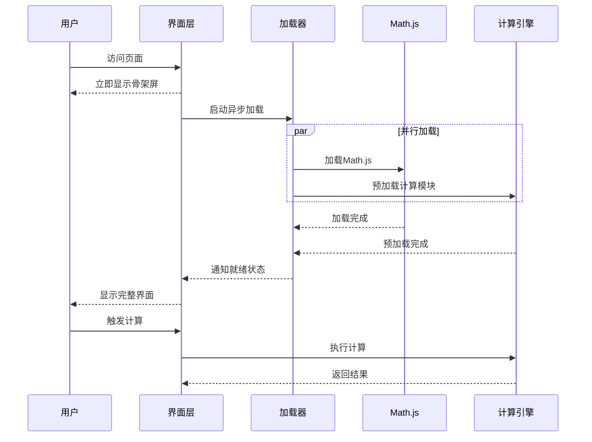

# 初始加载性能优化设计文档

## 概述

本设计文档旨在解决Rauzy分形工作台初次加载时出现的严重性能问题，包括页面无响应、长时间阻塞主线程等问题。通过重新设计初始化流程、优化资源加载策略和实现渐进式加载，确保用户获得流畅的初始体验。

## 架构设计

### 分层初始化架构

```
┌─────────────────────────────────────────┐
│           用户界面层 (立即显示)            │
├─────────────────────────────────────────┤
│         基础功能层 (异步加载)             │
├─────────────────────────────────────────┤
│         计算引擎层 (按需加载)             │
├─────────────────────────────────────────┤
│         渲染优化层 (延迟初始化)           │
└─────────────────────────────────────────┘
```

### 初始化时序设计



## 组件设计

### 1. 启动管理器 (BootstrapManager)

**职责**: 协调整个初始化过程，确保各组件按正确顺序加载

```typescript
interface BootstrapManager {
  // 启动应用
  bootstrap(): Promise<void>;
  
  // 检查依赖状态
  checkDependencies(): DependencyStatus;
  
  // 注册初始化步骤
  registerStep(step: InitializationStep): void;
  
  // 获取加载进度
  getProgress(): number;
}
```

**关键特性**:
- 非阻塞初始化流程
- 依赖关系管理
- 错误恢复机制
- 进度追踪

### 2. 资源加载器 (ResourceLoader)

**职责**: 管理外部资源的异步加载，避免阻塞主线程

```typescript
interface ResourceLoader {
  // 加载Math.js库
  loadMathJS(): Promise<void>;
  
  // 预加载计算模块
  preloadComputeModules(): Promise<void>;
  
  // 检查资源状态
  getResourceStatus(resource: string): LoadStatus;
  
  // 设置加载优先级
  setPriority(resource: string, priority: number): void;
}
```

**加载策略**:
- 关键资源优先加载
- 非关键资源延迟加载
- 失败重试机制
- 加载进度反馈

### 3. 状态管理器 (StateManager)

**职责**: 管理应用的初始化状态，协调UI和后台加载

```typescript
interface StateManager {
  // 应用状态
  state: {
    isInitializing: boolean;
    mathJSLoaded: boolean;
    computeEngineReady: boolean;
    uiReady: boolean;
  };
  
  // 状态更新
  updateState(updates: Partial<AppState>): void;
  
  // 状态监听
  onStateChange(callback: StateChangeCallback): void;
  
  // 检查就绪状态
  isReadyFor(operation: string): boolean;
}
```

### 4. 骨架屏组件 (SkeletonLoader)

**职责**: 在内容加载期间显示占位界面，提升感知性能

```typescript
interface SkeletonLoader {
  // 显示骨架屏
  show(): void;
  
  // 隐藏骨架屏
  hide(): void;
  
  // 更新加载进度
  updateProgress(progress: number): void;
  
  // 显示加载消息
  showMessage(message: string): void;
}
```

## 数据流设计

### 初始化数据流

```
页面加载 → 骨架屏显示 → 异步资源加载 → 状态更新 → UI激活 → 用户交互
```

### 错误处理流

```
加载失败 → 错误检测 → 降级策略 → 用户通知 → 重试机制
```

## 性能优化策略

### 1. 代码分割 (Code Splitting)

- **关键路径**: 立即加载UI框架和基础样式
- **次要路径**: 延迟加载Math.js和计算引擎
- **按需加载**: 根据用户操作动态加载功能模块

### 2. 资源优先级

```
优先级1: HTML, 关键CSS, 基础JS
优先级2: React组件, 状态管理
优先级3: Math.js, 计算引擎
优先级4: 高级功能, 分析工具
```

### 3. 缓存策略

- **静态资源**: 长期缓存CSS/JS文件
- **动态数据**: 会话级缓存计算结果
- **用户设置**: 本地存储用户偏好

### 4. 预加载优化

- **DNS预解析**: 提前解析CDN域名
- **资源预加载**: 在空闲时预加载Math.js
- **模块预编译**: 预编译计算着色器

## 错误处理设计

### 1. 降级策略

```typescript
interface FallbackStrategy {
  // Math.js加载失败
  onMathJSLoadFailed(): void;
  
  // WebGL不可用
  onWebGLUnavailable(): void;
  
  // 网络连接问题
  onNetworkError(): void;
  
  // 浏览器兼容性问题
  onCompatibilityIssue(): void;
}
```

### 2. 错误恢复

- **自动重试**: 网络错误自动重试3次
- **手动重试**: 提供用户手动重试按钮
- **离线模式**: 基础功能离线可用
- **兼容性检测**: 自动检测并提示兼容性问题

## 监控和调试

### 1. 性能指标

- **FCP (First Contentful Paint)**: 首次内容绘制时间
- **LCP (Largest Contentful Paint)**: 最大内容绘制时间
- **TTI (Time to Interactive)**: 可交互时间
- **FID (First Input Delay)**: 首次输入延迟

### 2. 调试工具

```typescript
interface PerformanceDebugger {
  // 记录性能指标
  recordMetric(name: string, value: number): void;
  
  // 分析加载瓶颈
  analyzeBottlenecks(): BottleneckReport;
  
  // 生成性能报告
  generateReport(): PerformanceReport;
  
  // 实时监控
  startMonitoring(): void;
}
```

## 实现计划

### 阶段1: 基础架构 (1-2天)
- 实现BootstrapManager
- 创建SkeletonLoader组件
- 设置基础状态管理

### 阶段2: 资源优化 (2-3天)
- 实现ResourceLoader
- 配置代码分割
- 优化资源加载顺序

### 阶段3: 错误处理 (1-2天)
- 实现降级策略
- 添加错误恢复机制
- 完善用户反馈

### 阶段4: 性能监控 (1天)
- 集成性能监控
- 添加调试工具
- 优化关键指标

## 成功指标

- **页面响应时间**: < 3秒完成初始渲染
- **主线程阻塞**: 无超过50ms的长任务
- **用户感知性能**: 骨架屏立即显示
- **错误率**: < 1%的初始化失败率
- **兼容性**: 支持95%的现代浏览器