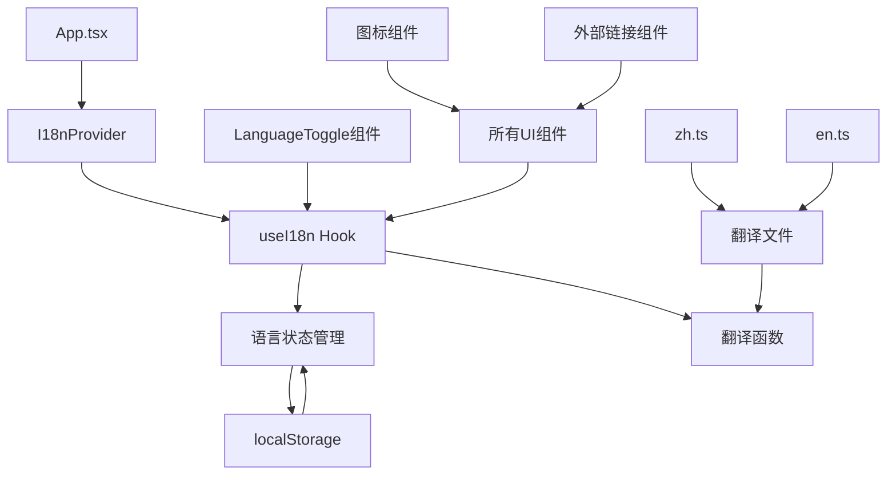

# 国际化支持设计文档

## 概述

为Rauzy分形工作台实现完整的中英文双语支持系统，包括语言切换、文本国际化、图标化界面元素和外部链接导航。采用React Context + Hook的模式实现轻量级国际化方案，确保良好的性能和用户体验。

## 架构

### 核心架构图



### 技术栈选择

- **国际化方案**: 自定义React Context + Hook（轻量级）
- **状态管理**: React Context API
- **持久化**: localStorage
- **图标库**: Heroicons（已在项目中使用）
- **类型安全**: TypeScript接口定义

## 组件和接口

### 1. 国际化核心系统

#### I18nContext 接口
```typescript
interface I18nContextType {
  language: Language;
  setLanguage: (lang: Language) => void;
  t: (key: string, params?: Record<string, string>) => string;
}

type Language = 'en' | 'zh';
```

#### 翻译文件结构
```typescript
interface Translations {
  app: {
    title: string;
    loading: string;
  };
  controls: {
    pathInput: {
      label: string;
      placeholder: string;
      addButton: string;
    };
    pathList: {
      title: string;
      empty: string;
      deleteTooltip: string;
      totalPaths: string;
    };
    pointsSlider: {
      label: string;
      unit: string;
      dragging: string;
    };
  };
  dataPanel: {
    title: string;
    noData: string;
    addPathHint: string;
    supportedFormats: string;
    totalAnalyzed: string;
  };
  canvas: {
    totalPoints: string;
    renderedPoints: string;
    renderTime: string;
  };
  notifications: {
    calculationComplete: string;
    calculationFailed: string;
    pathAdded: string;
    calculationCanceled: string;
  };
  links: {
    liuTheorem: string;
    github: string;
    liuTheoremTooltip: string;
    githubTooltip: string;
  };
  common: {
    delete: string;
    cancel: string;
    confirm: string;
    loading: string;
  };
}
```

### 2. 语言切换组件

#### LanguageToggle 组件
```typescript
interface LanguageToggleProps {
  className?: string;
}

// 功能特性：
// - 地球图标 + 当前语言代码显示
// - 点击切换语言
// - 平滑过渡动画
// - 响应式设计
```

### 3. 图标化组件

#### DeleteButton 组件
```typescript
interface DeleteButtonProps {
  onClick: () => void;
  tooltip?: string;
  size?: 'sm' | 'md' | 'lg';
  className?: string;
}

// 使用 TrashIcon 替换文字"删除"按钮
```

### 4. 外部链接组件

#### ExternalLinks 组件
```typescript
interface ExternalLinksProps {
  className?: string;
}

// 包含：
// - 刘氏定理链接（学术图标）
// - GitHub仓库链接（GitHub图标）
// - 新标签页打开
// - 悬停提示
```

## 数据模型

### 语言配置
```typescript
const LANGUAGE_CONFIG = {
  DEFAULT_LANGUAGE: 'en' as const,
  STORAGE_KEY: 'rauzy-workbench-language',
  SUPPORTED_LANGUAGES: ['en', 'zh'] as const
};
```

### 翻译数据结构
```typescript
// en.ts
export const en: Translations = {
  app: {
    title: "Rauzy Fractal Workbench",
    loading: "Loading..."
  },
  controls: {
    pathInput: {
      label: "Build Path (e.g., 1213)",
      placeholder: "Enter path, e.g., 1213 or 1,2,1,3",
      addButton: "Add Path to List"
    },
    // ... 更多翻译
  }
};

// zh.ts  
export const zh: Translations = {
  app: {
    title: "Rauzy 分形工作台",
    loading: "加载中..."
  },
  controls: {
    pathInput: {
      label: "构建路径 (例如: 1213)",
      placeholder: "输入路径，如: 1213 或 1,2,1,3",
      addButton: "添加路径到列表"
    },
    // ... 更多翻译
  }
};
```

## 错误处理

### 翻译缺失处理
```typescript
const t = (key: string, params?: Record<string, string>): string => {
  try {
    const translation = getNestedValue(translations[language], key);
    if (!translation) {
      console.warn(`Translation missing for key: ${key} in language: ${language}`);
      return key; // 返回key作为fallback
    }
    return interpolateParams(translation, params);
  } catch (error) {
    console.error(`Translation error for key: ${key}`, error);
    return key;
  }
};
```

### 语言切换错误处理
```typescript
const setLanguage = (lang: Language) => {
  try {
    if (!LANGUAGE_CONFIG.SUPPORTED_LANGUAGES.includes(lang)) {
      console.warn(`Unsupported language: ${lang}, falling back to default`);
      lang = LANGUAGE_CONFIG.DEFAULT_LANGUAGE;
    }
    
    setCurrentLanguage(lang);
    localStorage.setItem(LANGUAGE_CONFIG.STORAGE_KEY, lang);
  } catch (error) {
    console.error('Failed to set language:', error);
    // 继续使用当前语言，不中断用户体验
  }
};
```

## 测试策略

### 单元测试
```typescript
describe('I18n System', () => {
  test('should translate keys correctly', () => {
    const { t } = renderHook(() => useI18n());
    expect(t('app.title')).toBe('Rauzy Fractal Workbench');
  });

  test('should handle missing translations', () => {
    const { t } = renderHook(() => useI18n());
    expect(t('nonexistent.key')).toBe('nonexistent.key');
  });

  test('should persist language preference', () => {
    const { setLanguage } = renderHook(() => useI18n());
    setLanguage('zh');
    expect(localStorage.getItem('rauzy-workbench-language')).toBe('zh');
  });
});
```

### 集成测试
```typescript
describe('Language Toggle', () => {
  test('should switch language when clicked', () => {
    render(<App />);
    const toggle = screen.getByTestId('language-toggle');
    fireEvent.click(toggle);
    expect(screen.getByText('Rauzy 分形工作台')).toBeInTheDocument();
  });
});
```

### 视觉回归测试
- 中英文界面截图对比
- 不同屏幕尺寸下的布局测试
- 图标按钮的视觉一致性测试

## 性能优化

### 懒加载翻译文件
```typescript
const loadTranslations = async (language: Language) => {
  const translations = await import(`../i18n/${language}.ts`);
  return translations.default;
};
```

### 翻译缓存
```typescript
const translationCache = new Map<string, string>();

const t = (key: string): string => {
  const cacheKey = `${language}-${key}`;
  if (translationCache.has(cacheKey)) {
    return translationCache.get(cacheKey)!;
  }
  
  const translation = getTranslation(key);
  translationCache.set(cacheKey, translation);
  return translation;
};
```

### 组件优化
```typescript
// 使用 React.memo 避免不必要的重渲染
const LanguageToggle = React.memo<LanguageToggleProps>(({ className }) => {
  const { language, setLanguage } = useI18n();
  // ...
});
```

## 布局适配

### 文本长度适配
```css
/* 中文文本通常比英文短，需要调整布局 */
.path-input-label {
  min-height: 1.5rem; /* 确保标签高度一致 */
}

.button-text {
  white-space: nowrap; /* 防止按钮文字换行 */
  overflow: hidden;
  text-overflow: ellipsis;
}
```

### 响应式图标
```css
.icon-button {
  @apply w-8 h-8 p-1.5 hover:bg-gray-600 rounded transition-colors;
}

.icon-button svg {
  @apply w-full h-full;
}

@media (max-width: 640px) {
  .icon-button {
    @apply w-10 h-10 p-2; /* 移动端更大的触摸目标 */
  }
}
```

## 外部链接配置

### 链接配置
```typescript
const EXTERNAL_LINKS = {
  LIU_THEOREM: {
    url: 'https://placeholder-liu-theorem.com', // 占位符链接
    icon: 'AcademicCapIcon',
    target: '_blank',
    rel: 'noopener noreferrer'
  },
  GITHUB: {
    url: 'https://github.com/your-username/rauzy-fractal-workbench',
    icon: 'CodeBracketIcon', 
    target: '_blank',
    rel: 'noopener noreferrer'
  }
} as const;
```

### 链接组件实现
```typescript
const ExternalLinks: React.FC<ExternalLinksProps> = ({ className }) => {
  const { t } = useI18n();
  
  return (
    <div className={`flex gap-2 ${className}`}>
      <a
        href={EXTERNAL_LINKS.LIU_THEOREM.url}
        target={EXTERNAL_LINKS.LIU_THEOREM.target}
        rel={EXTERNAL_LINKS.LIU_THEOREM.rel}
        className="icon-button"
        title={t('links.liuTheoremTooltip')}
      >
        <AcademicCapIcon />
      </a>
      
      <a
        href={EXTERNAL_LINKS.GITHUB.url}
        target={EXTERNAL_LINKS.GITHUB.target}
        rel={EXTERNAL_LINKS.GITHUB.rel}
        className="icon-button"
        title={t('links.githubTooltip')}
      >
        <CodeBracketIcon />
      </a>
    </div>
  );
};
```

## 可访问性

### 语义化标记
```typescript
<button
  aria-label={t('common.switchLanguage')}
  role="button"
  tabIndex={0}
>
  <GlobeAltIcon aria-hidden="true" />
  <span className="sr-only">{t('common.currentLanguage', { lang: language })}</span>
</button>
```

### 键盘导航
```typescript
const handleKeyDown = (e: React.KeyboardEvent) => {
  if (e.key === 'Enter' || e.key === ' ') {
    e.preventDefault();
    toggleLanguage();
  }
};
```

### 高对比度支持
```css
@media (prefers-contrast: high) {
  .icon-button {
    @apply border border-current;
  }
  
  .language-toggle {
    @apply bg-yellow-400 text-gray-900;
  }
}
```

## 部署考虑

### 构建优化
- 翻译文件代码分割
- 未使用翻译的tree-shaking
- 图标按需加载

### SEO优化
```html
<html lang={language}>
  <head>
    <title>{t('app.title')}</title>
    <meta name="description" content={t('app.description')} />
  </head>
</html>
```

### 缓存策略
- 翻译文件长期缓存
- 语言偏好本地存储
- 图标资源缓存优化