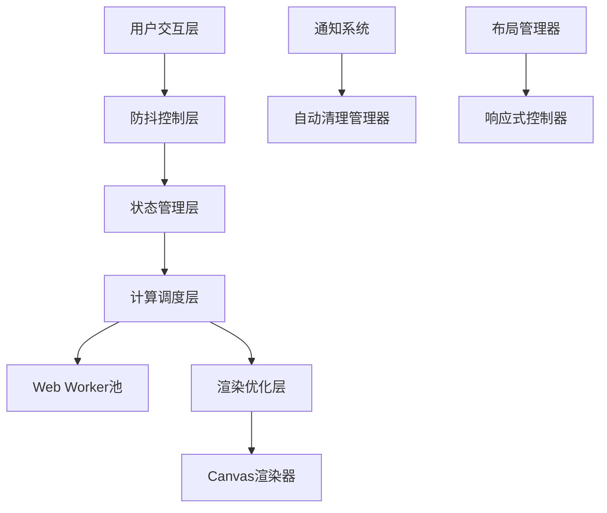

# UI性能优化设计文档

## 概述

本设计文档详细描述了Rauzy分形工作台的用户体验和性能优化方案，重点解决通知系统、布局响应性、交互延迟和计算性能等关键问题。

## 架构

### 整体架构优化



## 组件和接口

### 1. 通知系统重构

#### NotificationManager接口
```typescript
interface NotificationManager {
  show(notification: Notification): string;
  hide(id: string): void;
  autoHide(id: string, delay: number): void;
  clear(): void;
}

interface Notification {
  id: string;
  type: 'success' | 'error' | 'warning' | 'info';
  message: string;
  autoHide?: boolean;
  duration?: number;
}
```

#### 设计决策
- **自动消失机制**: 成功通知2秒后自动消失，错误通知需手动关闭
- **队列管理**: 最多同时显示5个通知，超出时移除最旧的
- **动画优化**: 使用CSS transform而非position变化，提升性能

### 2. 响应式布局系统

#### LayoutManager接口
```typescript
interface LayoutManager {
  updateLayout(screenWidth: number): LayoutConfig;
  setPanelWidth(width: number): void;
  getOptimalSizes(): PanelSizes;
}

interface LayoutConfig {
  leftPanelWidth: number;
  rightPanelWidth: number;
  canvasWidth: number;
  breakpoint: 'mobile' | 'tablet' | 'desktop';
}
```

#### 设计决策
- **断点设计**: 800px(mobile), 1200px(tablet), 1200px+(desktop)
- **面板宽度**: 桌面端右侧面板最小300px，平板端25%，移动端可折叠
- **自适应画布**: 画布自动填充剩余空间，保持长宽比

### 3. 防抖交互控制

#### DebounceController接口
```typescript
interface DebounceController {
  debounce<T extends (...args: any[]) => any>(
    func: T, 
    delay: number, 
    immediate?: boolean
  ): T;
  throttle<T extends (...args: any[]) => any>(
    func: T, 
    delay: number
  ): T;
  cancel(func: Function): void;
}
```

#### 设计决策
- **滑块防抖**: 500ms延迟，避免频繁计算
- **输入防抖**: 300ms延迟，平衡响应性和性能
- **取消机制**: 组件卸载时自动取消所有防抖函数

### 4. 计算性能优化

#### ComputationScheduler接口
```typescript
interface ComputationScheduler {
  schedule(task: ComputationTask): Promise<ComputationResult>;
  cancel(taskId: string): void;
  getProgress(taskId: string): number;
  setWorkerPool(size: number): void;
}

interface ComputationTask {
  id: string;
  type: 'rauzy-core' | 'path-analysis';
  params: any;
  priority: 'low' | 'normal' | 'high';
  useWorker: boolean;
}
```

#### 设计决策
- **Web Worker池**: 根据CPU核心数创建Worker，最多4个
- **任务优先级**: 用户交互任务高优先级，后台计算低优先级
- **进度追踪**: 大任务分块处理，提供实时进度反馈

### 5. 渲染优化系统

#### RenderOptimizer接口
```typescript
interface RenderOptimizer {
  setLOD(level: number): void;
  updateViewport(bounds: ViewportBounds): void;
  shouldRender(point: Point): boolean;
  getBatchSize(): number;
}

interface ViewportBounds {
  minX: number;
  maxX: number;
  minY: number;
  maxY: number;
  scale: number;
}
```

#### 设计决策
- **视口裁剪**: 只渲染可见区域内的点
- **LOD渲染**: 根据点数量自动调整渲染质量
- **分批渲染**: 大数据集分批渲染，避免UI阻塞

## 数据模型

### 性能监控模型
```typescript
interface PerformanceMetrics {
  renderTime: number;
  computationTime: number;
  memoryUsage: number;
  fps: number;
  pointCount: number;
  timestamp: number;
}

interface PerformanceThresholds {
  maxRenderTime: number;    // 16ms (60fps)
  maxComputationTime: number; // 100ms
  maxMemoryUsage: number;   // 100MB
  minFPS: number;          // 30fps
}
```

### 缓存管理模型
```typescript
interface CacheManager {
  set(key: string, value: any, ttl?: number): void;
  get(key: string): any | null;
  clear(): void;
  cleanup(): void;
  getStats(): CacheStats;
}

interface CacheStats {
  size: number;
  hitRate: number;
  memoryUsage: number;
}
```

## 错误处理

### 性能降级策略
1. **渲染降级**: FPS < 30时自动降低渲染质量
2. **计算降级**: 内存不足时减少缓存大小
3. **功能降级**: 极端情况下禁用动画和特效

### 错误恢复机制
1. **Worker崩溃**: 自动重启Worker并重新分配任务
2. **内存泄漏**: 定期清理和垃圾回收
3. **渲染错误**: 回退到基础渲染模式

## 测试策略

### 性能测试
1. **渲染性能**: 测试不同点数下的FPS
2. **计算性能**: 测试大数据集的处理时间
3. **内存测试**: 长时间运行的内存使用情况
4. **响应性测试**: 用户交互的响应延迟

### 用户体验测试
1. **通知系统**: 验证自动消失和手动关闭
2. **布局响应**: 测试不同屏幕尺寸的适配
3. **交互流畅性**: 验证防抖和节流效果
4. **加载体验**: 测试进度指示和取消功能

### 兼容性测试
1. **浏览器兼容**: Chrome, Firefox, Safari, Edge
2. **设备兼容**: 桌面端、平板、手机
3. **性能基准**: 不同硬件配置的性能表现

## 实现优先级

### 高优先级 (立即实现)
1. 通知系统自动消失
2. 滑块防抖优化
3. 右侧面板宽度调整

### 中优先级 (1-2周内)
1. 计算进度指示
2. 渲染性能优化
3. 响应式布局完善

### 低优先级 (后续版本)
1. Web Worker集成
2. 高级缓存策略
3. 性能监控面板